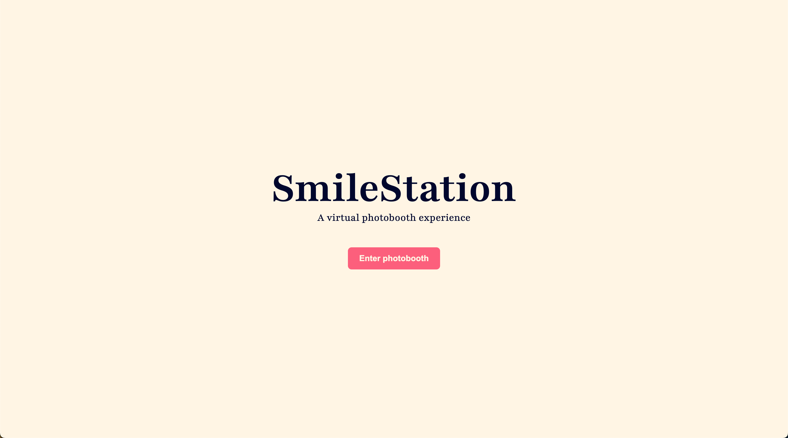
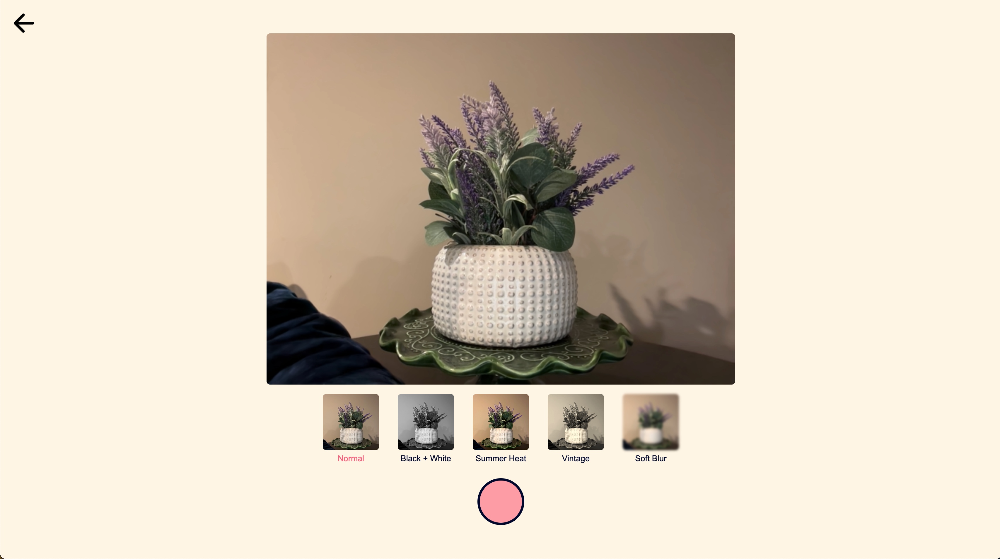
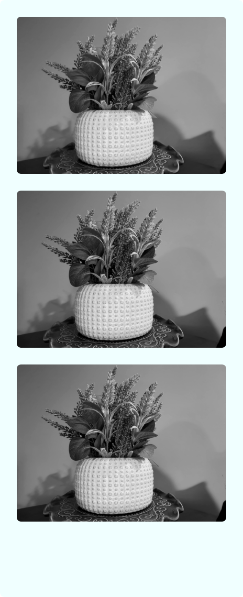

# 
SmileStation

Web app that virtually recreates a photobooth experience!

---

# Live Demo

#### 
Try the app [here](https://smilestation.vercel.app/) 

---

# Features
- Take pictures using webcam
- Choose from different filters
- Pick the color of the photostrip
- Download the photostrip as a PNG file

# Tech Stack
- Next.js
- Javascript
- TailwindCSS
- Framer Motion
- downloadjs
- html2canvas

# Future Improvements
- Add ability to add custom text to photostrips